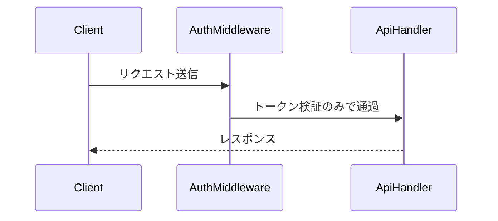
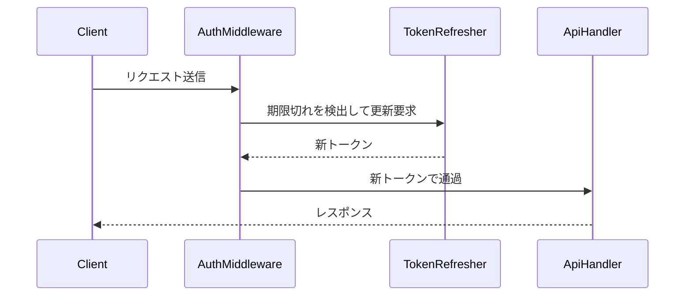

# PR 作成

現在のブランチを push し、変更内容から **日本語の** PR を作成する。どのリポジトリでも使えるよう、base ブランチはリポジトリのデフォルトブランチを検出して用いる。

実装・テスト・commit は別の作業の責務。このスキルは commit 済みの変更を前提に、push と PR 作成のみを行う。

---

## 手順

### 1. 事前チェック(失敗したら理由を報告して停止)

- リポジトリのデフォルトブランチを検出し、以降 `<base>` として使う。
  ```bash
  git remote show origin | sed -n 's/.*HEAD branch: //p'
  ```
  取得できない場合は `gh repo view --json defaultBranchRef -q .defaultBranchRef.name` を使う。
- カレントブランチを確認。`<base>` と同じ場合は停止し、作業ブランチに切り替えるよう促す。
  ```bash
  git rev-parse --abbrev-ref HEAD
  ```
- 作業ツリーがクリーンか確認する。未コミットの差分があれば、**このスキルでは commit しない**ため、停止して「commit してから再実行」するよう促す。
  ```bash
  git status --porcelain
  ```
- `<base>` との差分(コミット)が存在することを確認する。差分が無ければ PR を作る対象が無いので報告して停止。
  ```bash
  git log --oneline origin/<base>..HEAD
  ```

### 2. Draft か通常 PR かの判断

- ユーザーの依頼内容や引数 `$ARGUMENTS` に「Draft で」「ドラフト」とあれば **Draft**、「通常で」「レビュー依頼して」など Draft でないことが明示されていれば **通常 PR** とする。
- どちらとも読み取れない場合は、安全側に倒して **Draft** で作成し、その旨をユーザーに伝える。

### 3. push

- HTTPS で push できない場合は、`gh auth status` で認証状態を確認する。認証を確認できない場合は、ユーザーに再認証してもらうよう促して停止する。
- 現在のブランチを push する。
  ```bash
  git push -u origin "$(git rev-parse --abbrev-ref HEAD)"
  ```

### 4. PR タイトル・本文の生成

- `<base>` との差分から、**日本語で** タイトルと本文を生成する。
  ```bash
  git log --oneline origin/<base>..HEAD        # コミットの流れ(タイトル生成に使う)
  git diff --stat origin/<base>..HEAD          # 変更の全体像
  git diff --name-status origin/<base>..HEAD   # A=新規 / M=変更 / D=削除 / R=リネーム
  git diff -U0 origin/<base>..HEAD             # @@ -a,b +c,d @@ の +c,d が変更後の行範囲
  ```
- `git diff --stat` からは行範囲が取れないため、後述の表の「変更行」は `git diff -U0` の hunk ヘッダ(`@@`)から求める。
- 引数 `$ARGUMENTS` でタイトルや補足が渡された場合はそれを優先・反映する。

#### PR テンプレートの確認

- リポジトリに PR テンプレートがあるか、次の場所を順に確認する。
  - `.github/pull_request_template.md`
  - `.github/PULL_REQUEST_TEMPLATE.md`
  - `pull_request_template.md`(リポジトリ直下)
  - `docs/pull_request_template.md`
  - `.github/PULL_REQUEST_TEMPLATE/` ディレクトリ(複数テンプレート)
- テンプレートがあれば、その見出し・構成に沿って本文を書く。ただし下記「本文に必ず含める内容」はテンプレートの適切なセクションに反映する(対応するセクションが無ければ末尾に追記する)。変更内容の表・処理フローのシーケンス図もこのルールに従う。
- テンプレートが無ければ、下記の 5 セクション構成で本文を書く。

#### 本文に必ず含める内容

1. **概要** — この PR で何をするのかを 1〜3 行で。
2. **変更内容** — 変更したファイルを表で(下記「変更内容の書き方」)。
3. **処理フロー** — 変更前 / 変更後のシーケンス図(下記「処理フローの書き方」)。
4. **この変更に至った過程** — 検討した案が複数あった場合、それぞれをどんな理由で採用・不採用にしたのかを簡潔に記述する。検討の余地が無かった場合はその旨を一言書く。
5. **テスト内容** — 実施したテストと結果をチェックボックスの箇条書きで(下記「テスト内容の書き方」)。

##### 変更内容の書き方(表)

箇条書きではなく、次の 3 列の表で書く。

| ファイル | 変更行 | 変更概要 |
|---|---|---|
| `src/foo/bar.ts` | L42-L58, L77 | 認証トークンの期限切れ判定を追加 |
| `src/foo/baz.ts` | 新規 | トークン更新クライアントを新規追加 |
| `src/old/legacy.ts` | 削除 | baz.ts に統合したため削除 |

- **ファイル** — リポジトリルートからの相対パス。バッククォートで囲む。
- **変更行** — **変更後**のファイルでの行範囲。単一行は `L77`、範囲は `L42-L58`、複数箇所は `, ` 区切り。新規ファイルは `新規`、削除ファイルは `削除`、リネームは `リネーム`(内容変更も伴う場合は行範囲を併記)。hunk が多いファイルは主要なものに絞り、末尾に `ほか` を付ける。
- **変更概要** — 何をどう変えたかを 1 行で。「修正」「更新」だけで終わらせず、変更の意図が分かる粒度で書く。

##### 処理フローの書き方(シーケンス図)

- mermaid の `sequenceDiagram` で **変更前** と **変更後** を別々のコードフェンスに分け、各フェンスの直前に `**変更前**` / `**変更後**` を置く。
- `participant` には実在するクラス・モジュール・関数・外部サービス名を使う(`ServiceA` のような抽象名にしない)。
- 変更で増えた / 消えた矢印が読み取れる粒度にし、変更と無関係な既存フローは省く。
- **新規ファイルの追加のみで変更前が存在しない場合** — 変更前には新規コードが差し込まれる既存の呼び出し経路を描き、変更後で新規の participant を追加する。
- **処理フローに変化が無い場合**(ドキュメント・コメント・設定値のみの変更など) — 図は描かず、`処理フローの変更なし` と 1 行だけ書く。
- メッセージ文に `:` や改行を含めない(mermaid のパースが壊れる)。改行が必要なら `<br/>` を使う。

雛形:

````markdown
**変更前**



**変更後**


````

##### テスト内容の書き方(チェックボックス)

実施したテストとその結果を、チェックボックスの箇条書きで書く。

- 実施して問題が無かったものは `- [x]`、未実施・未確認・失敗が残っているものは `- [ ]` にする。
- 各項目は「何を確認したか — 結果」の形で書く。実行したコマンドがあればバッククォートで囲んで残す。
- `- [ ]` の項目には、なぜ未実施なのか / いつ誰が確認するのかを添える。
- テストを 1 つも実施していない場合も、`- [ ] 未実施 — <理由>` と 1 行書いて省略しない。

雛形:

```markdown
- [x] `npm test` — 全 128 件 pass
- [x] `npm run lint` — 指摘なし
- [x] 手動確認 — ローカルでトークンの期限切れを再現し、自動で再取得されることを確認
- [ ] ステージング環境での確認 — 未実施(デプロイ後にレビュアーと確認予定)
```

### 5. PR 作成

- 生成した本文を一時ファイルに書き、`gh` で PR を作成する。Draft の場合のみ `--draft` を付ける。本文の改行や記号を壊さないよう、`--body` に直接渡さない。
  ```bash
  gh pr create [--draft] --base <base> --title "<日本語タイトル>" --body-file <本文の一時ファイル>
  ```
- 作成された PR の URL と、Draft / 通常のどちらで作成したかをユーザーに報告して完了。

---

## 停止・報告ポイント

次の場合は、それまでの結果を添えて明確に報告し停止する。

- デフォルトブランチ上にいる / 作業ツリーが汚れている / base との差分が無い
- デフォルトブランチの検出に失敗した
- `git push` の失敗(認証など)
- `gh pr create` の失敗

## 注意

- commit はこのスキルでは行わない。未コミット差分があれば停止する。
- base ブランチを `main` と決め打ちしない。必ずデフォルトブランチを検出する。
- タイトル・本文は **日本語** で生成する。
